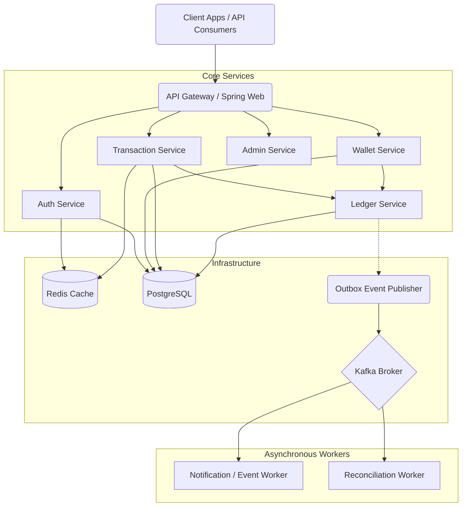

# Architecture Document: Digital Wallet Platform

This document outlines the backend architecture for a Spring Boot-based Digital Wallet application, satisfying the requirements defined in the MVP PRD.

---

## 1. Component Architecture

The backend is structured as a modular monolith (or microservices, depending on scale) centered around Spring Boot.

### Component Responsibilities
*   **Auth Service**: Handles user registration, authentication, JWT issuing, and validation.
*   **Wallet Service**: Manages wallet lifecycle (creation, status) and queries aggregate balances.
*   **Transaction Service**: Orchestrates money movement (add, withdraw, transfer). Validates limits, idempotency, and available balance.
*   **Ledger Service**: The source of truth for all financial data. Handles double-entry bookkeeping, writing immutable `ledger_entries`, and safely updating the materialized `wallet.balance`.
*   **Notification/Event Service**: Consumes Kafka events to trigger asynchronous side effects (e.g., logging, metrics, webhooks).
*   **Reconciliation Service**: Runs background checks comparing `wallet.balance` against the sum of `ledger_entries` to ensure data integrity.
*   **Admin Service**: Exposes internal APIs for dashboard oversight and account management.

---

## 2. Relational Data Model (PostgreSQL)

### Schema Design

**1. `users`**
*   `id` (UUID, PK)
*   `email` (VARCHAR, Unique, Index)
*   `password_hash` (VARCHAR)
*   `role` (VARCHAR) - e.g., 'USER', 'ADMIN'
*   `created_at` (TIMESTAMP)

**2. `wallets`**
*   `id` (UUID, PK)
*   `user_id` (UUID, FK -> users.id, Unique, Index)
*   `balance` (NUMERIC(19,4)) - Materialized view of balance. Constraint: `CHECK (balance >= 0)`
*   `status` (VARCHAR) - 'ACTIVE', 'FROZEN'
*   `currency` (VARCHAR) - e.g., 'USD'
*   `version` (INTEGER) - For optimistic locking (if used)
*   `updated_at` (TIMESTAMP)

**3. `transactions`**
*   `id` (UUID, PK)
*   `type` (VARCHAR) - 'ADD_FUNDS', 'WITHDRAW', 'TRANSFER'
*   `status` (VARCHAR) - 'PENDING', 'COMPLETED', 'FAILED'
*   `amount` (NUMERIC(19,4))
*   `currency` (VARCHAR)
*   `idempotency_key` (VARCHAR, Unique, Index)
*   `created_at` (TIMESTAMP)

**4. `ledger_entries`**
*   `id` (UUID, PK)
*   `transaction_id` (UUID, FK -> transactions.id, Index)
*   `wallet_id` (UUID, FK -> wallets.id, Index)
*   `direction` (VARCHAR) - 'CREDIT' (adds money), 'DEBIT' (removes money)
*   `amount` (NUMERIC(19,4))
*   `balance_after` (NUMERIC(19,4)) - Snapshot of balance after this entry
*   `created_at` (TIMESTAMP)

**5. `idempotency_keys`** (Optional if using Redis, but good for durable persistence)
*   `key` (VARCHAR, PK)
*   `response_status` (INTEGER)
*   `response_body` (JSONB)
*   `expires_at` (TIMESTAMP)

**6. `outbox_events`**
*   `id` (UUID, PK)
*   `aggregate_type` (VARCHAR) - e.g., 'TRANSACTION'
*   `aggregate_id` (UUID)
*   `type` (VARCHAR) - e.g., 'TRANSFER_COMPLETED'
*   `payload` (JSONB)
*   `processed_at` (TIMESTAMP, Nullable)

### Why a Double-Entry Ledger?
Simply mutating `wallet.balance` directly is dangerous. If a race condition or bug occurs, you lose the audit trail of *why* the balance is what it is. A double-entry ledger ensures that every transaction is represented as an immutable record of credits and debits. The `wallet.balance` column is merely a cached optimization (materialized view) of the sum of all a wallet's `ledger_entries`. If the balance is ever questioned, it can be deterministically recalculated from the ledger.

---

## 3. API Surface

| Method | Path | Auth | Purpose |
| :--- | :--- | :--- | :--- |
| `POST` | `/api/v1/auth/register` | None | Create a new user (and trigger default wallet creation). |
| `POST` | `/api/v1/auth/login` | None | Authenticate and return JWT. |
| `GET` | `/api/v1/wallets/me` | USER | Retrieve current wallet balance and status. |
| `POST` | `/api/v1/wallets/me/add-funds` | USER | Simulate adding funds (requires `Idempotency-Key` header). |
| `POST` | `/api/v1/wallets/me/withdraw` | USER | Simulate withdrawing funds (requires `Idempotency-Key`). |
| `POST` | `/api/v1/transfers` | USER | Initiate a P2P transfer to another user (requires `Idempotency-Key`). |
| `GET` | `/api/v1/transactions` | USER | Paginated list of a user's transaction history / passbook. |
| `GET` | `/api/v1/admin/users` | ADMIN | List all users and their basic details. |
| `POST` | `/api/v1/admin/users/{id}/freeze` | ADMIN | Freeze a user's wallet to prevent transactions. |

---

## 4. Infrastructure: Redis & Kafka

### Redis
*   **Idempotency Key Cache**: Fast lookups for the `Idempotency-Key` header. If a key is present and currently processing, block or return a 409 Conflict. If completed, return the cached successful response.
*   **Rate Limiting**: Track requests per IP/User to enforce the daily transfer limits and prevent API abuse (e.g., using Token Bucket algorithm).
*   **Session / Token Blacklist**: Since JWTs are stateless, logout or compromised account flows require storing invalidated JWT signatures in Redis with a TTL matching the token's expiration.

### Kafka (Message Broker)
Used for asynchronous, decoupled processing (via the Transactional Outbox Pattern to guarantee event delivery).
*   **Topics**:
    *   `wallet.money.credited`
    *   `wallet.money.debited`
    *   `wallet.transfer.completed`
    *   `ledger.reconciliation.mismatch`
*   **Consumers**: Webhook delivery engines, analytical data lakes, and automated reconciliation jobs that flag suspicious anomalies.

---

## 5. Concurrency Strategy: Preventing Double Spends

When two requests attempt to withdraw/transfer from the same wallet simultaneously, we must prevent the balance from dropping below zero.

### Options Evaluated
1.  **Optimistic Locking (`@Version` in JPA)**:
    *   *How it works*: Includes a version number in the update (`UPDATE wallets SET balance = ?, version = 2 WHERE id = ? AND version = 1`).
    *   *Pros*: Fast, non-blocking for reads.
    *   *Cons*: Under high concurrency (e.g., a burst of small payments), this leads to `OptimisticLockException`. The application must implement retry loops, which can degrade UX and spike CPU.
2.  **Pessimistic Locking (`SELECT ... FOR UPDATE`)**:
    *   *How it works*: Locks the specific wallet row in Postgres until the transaction commits.
    *   *Pros*: Guaranteed sequential execution. No retry loops needed in the application code.
    *   *Cons*: Can cause deadlocks if transferring A -> B and B -> A simultaneously unless rows are always locked in a consistent order.
3.  **DB-Level Constraints (`CHECK balance >= 0`)**:
    *   *How it works*: Postgres refuses to commit the transaction if the update forces balance below zero.
    *   *Pros*: The ultimate safety net; impossible to bypass.
    *   *Cons*: Not a complete strategy on its own, as you still need to prevent lost updates (overwriting a concurrent change) during the read-modify-write cycle.

### Recommendation
**Pessimistic Locking (`SELECT FOR UPDATE`) combined with DB-Level Constraints.**

For financial ledgers, strong consistency and preventing data corruption outweigh absolute raw throughput. 
1. The DB constraint (`CHECK balance >= 0`) is applied as a hard safety net.
2. The application uses Pessimistic Write Locks (`@Lock(LockModeType.PESSIMISTIC_WRITE)` in Spring Data JPA) on the wallet row.
3. **Deadlock Prevention**: When executing a P2P transfer, the Transaction Service must *always sort the Wallet IDs* (e.g., alphanumerically) before acquiring the locks. By ensuring that `Wallet A` and `Wallet B` are always locked in the exact same order regardless of who is sending to whom, database deadlocks are completely eliminated.

---

## 6. SRE Addendum: Risk & Observability

### 6.1 Single Points of Failure (SPOFs)
*   **PostgreSQL Database**: The relational DB is the primary SPOF. If the master node goes down, the entire system stops processing transactions. *Mitigation*: Multi-AZ synchronous replication with automated failover (e.g., AWS RDS Multi-AZ, Patroni).
*   **Redis Cache**: If Redis fails, idempotency checks and rate limiting fail, potentially halting the API or exposing it to abuse/duplicate requests if set to fail-open. *Mitigation*: Use Redis Cluster or managed highly available Redis (ElastiCache).

### 6.2 Kafka Failure & Event Publishing
*   **Impact**: If Kafka is down when a transfer completes, the transfer **must still succeed** for the user. Financial correctness takes priority over downstream side-effects.
*   **Pattern**: Event publishing must be **transactional (Outbox Pattern)**. The system writes to the `outbox_events` table in the exact same Postgres transaction as the `ledger_entries`. A separate background process (e.g., Debezium CDC or a polling relay) reads the outbox and pushes to Kafka. If Kafka goes down, the event safely waits in the outbox table until Kafka recovers. "Best-effort" direct publishing will inevitably lose events and is unacceptable here.

### 6.3 App Crash After DB Commit (Idempotency)
*   **Scenario**: The database commits the transfer, but the Spring Boot app crashes before sending the `200 OK` response. The client times out and retries with the same request.
*   **Protection**: The client retries using the exact same `Idempotency-Key`. Because the `idempotency_keys` record was inserted as part of the original atomic database transaction, the retry request will find the key already marked as `COMPLETED`. The system intercepts this at the API layer and simply returns the cached success response (or queries the DB to construct it), completely avoiding a double-spend.

### 6.4 Observability (Logging & Metrics)
*   **Logging Standards**:
    *   *Structured Logging*: All logs must be output in JSON format for ingestion by tools like ELK/Datadog.
    *   *Correlation IDs*: Every incoming HTTP request must generate (or accept) an `X-Correlation-ID`. This ID must be injected into the SLF4J MDC (Mapped Diagnostic Context) so every log line tied to that request includes it, allowing full tracing of a transaction's lifecycle.
*   **Day-One Metrics (Prometheus/Micrometer)**:
    *   `transaction_success_rate` (Counter): Ratio of successful vs failed transfers. A sudden drop indicates an incident.
    *   `api_latency_p99` (Histogram): The 99th percentile response time for critical paths (`/transfers`, `/withdraw`).
    *   `idempotency_hit_rate` (Counter): Tracks how often the API intercepts retries. A spike may indicate network issues or slow processing times causing client timeouts.
    *   `ledger_balance_drift` (Gauge): Emitted by the Reconciliation Worker. It measures `SUM(ledger_entries) - wallet.balance`. This gauge **must always be exactly 0**. Any deviation is a SEV-1 data corruption incident.

### 6.5 Partial Failures & Compensation
*   **Monolithic Safety**: In the current modular monolith design using Postgres, partial failures (e.g., debit succeeds but credit throws an exception) are intrinsically handled by standard **ACID transaction rollbacks**. The `SELECT FOR UPDATE` block runs inside an `@Transactional` method, so an error aborts the entire operation safely.
*   **Distributed Future (Saga Pattern)**: If this architecture evolves into distributed microservices (where Wallet A and Wallet B live in different databases), a two-phase commit (2PC) is too slow. Instead, use a **Choreography Saga**: if the debit succeeds but the remote credit step fails, the system must publish a `transfer.failed` event. A compensation worker listens for this and executes a **compensating transaction** (a reverse `ADD_FUNDS` ledger entry) to refund the sender, ensuring eventual consistency.